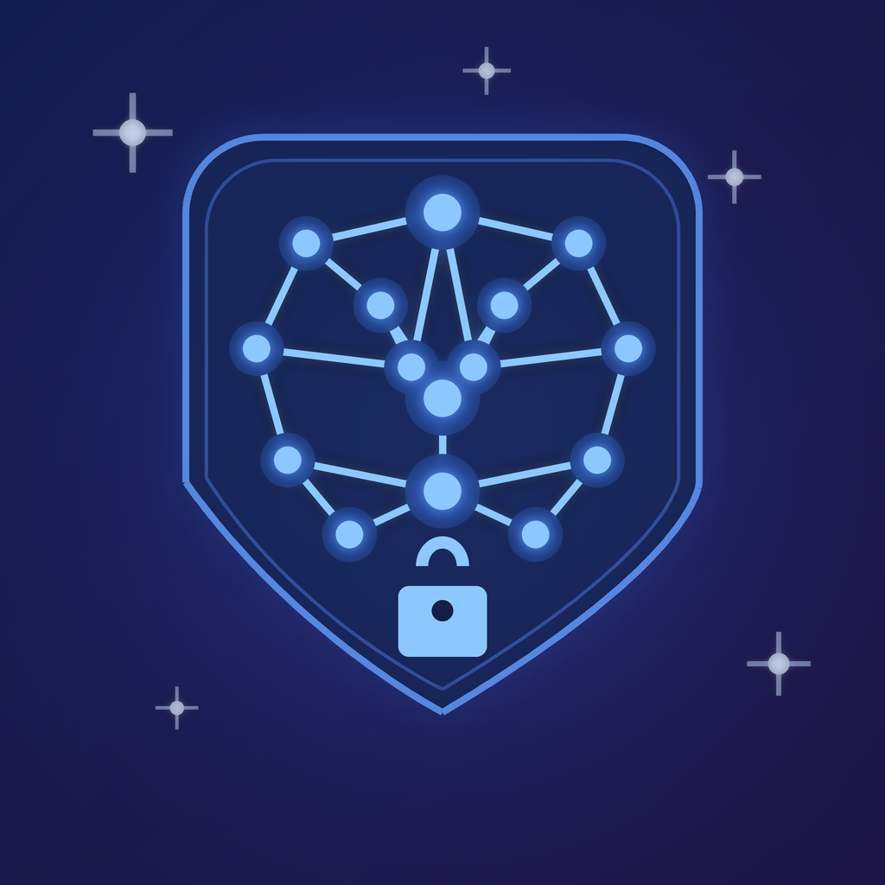

<p align="center">
  
</p>

<h1 align="center">SafeThink</h1>

<p align="center">
  <strong>The AI assistant that never sends your data anywhere.</strong>
</p>

<p align="center">
  
  
  
  
</p>

---

SafeThink is a privacy-first AI assistant for iPhone that runs Qwen 3.5 large language models **entirely on-device** via llama.cpp. No cloud APIs, no telemetry, no data collection. Your conversations, documents, and photos never leave your phone.

## Features

- **On-Device LLM Inference** — Run Qwen 3.5 4B (Q4_K_M quantized) locally via llama.cpp with streaming token generation, batched prefill, and 8K context window with automatic budget management.
- **Chat Interface** — Full ChatGPT-like experience with markdown rendering, code syntax highlighting, conversation history, search, pin & archive.
- **Document Analysis** — Import PDF, TXT, or CSV files. Document text is extracted on-device, injected as context, and the model answers questions about the content.
- **Image Analysis** — Attach photos and the app analyzes them using Apple's Vision framework (OCR text recognition, image classification, face detection, barcode/QR detection) and passes a text description to the LLM.
- **Image Editing** — Built-in filters (sepia, B&W, vivid, blur), brightness/contrast adjustment, background removal, auto-enhance, and rotation — all via Core Image.
- **Web Search** — DuckDuckGo web search triggered via the attachment menu or `/search` command. Real HTML search results are parsed and injected as LLM context. All network activity is logged.
- **Persistent Memory** — The assistant remembers facts across conversations using embedding-based retrieval (all-MiniLM-L6-v2), injected into system prompts automatically.
- **Voice Input** — Speech recognition using Apple's on-device SFSpeechRecognizer.
- **Biometric Lock** — Face ID / Touch ID protection.
- **Privacy Dashboard** — View every network request the app has ever made. Full transparency.
- **Export** — Export conversations as JSON, Markdown, TXT, or PDF.

## Privacy

SafeThink is built with a zero-data-collection architecture:

- All AI inference runs on Apple Silicon (CPU/GPU/ANE)
- No analytics, no crash reporting SDKs, no tracking
- Network access is **only** used for model downloads (HuggingFace) and optional user-triggered web search (DuckDuckGo)
- Every outbound request is logged and visible in the Privacy Dashboard
- Model files are excluded from iCloud backup

## Supported Devices

SafeThink is **iPhone only** and requires **6 GB+ RAM** for the Qwen 3.5 4B model.

| RAM | Devices |
|-----|---------|
| 6 GB | iPhone 12 Pro/Max, 13 Pro/Max, 14/Plus/Pro/Max, 15/Plus |
| 8 GB | iPhone 15 Pro/Max, 16/Plus/Pro/Max |

Devices with < 6 GB RAM (iPhone 12, 13, 13 mini, SE 3rd gen) will see a warning at launch.

Requires **iOS 17+** and **~3 GB** free storage for the model download.

## Architecture

```
MVVM + Service Layer (SwiftUI)

SafeThinkApp
  ├── OnboardingView
  ├── LockScreenView (biometric auth)
  └── ContentView (TabBar)
        ├── Chat        — ChatView + ConversationListView
        ├── Models      — ModelManagerView (download/manage)
        ├── Privacy     — PrivacyDashboardView (network logs)
        └── Settings    — SettingsView (security, export, model config)
```

### Key Services

| Service | Role |
|---------|------|
| `InferenceService` | llama.cpp model loading, batched prefill, streaming generation, context safety |
| `EmbeddingService` | all-MiniLM-L6-v2 text embeddings (384D, iOS 18+) |
| `DatabaseService` | SQLite via GRDB with FTS5 full-text search |
| `ModelDownloadService` | HuggingFace GGUF model downloads with progress tracking |
| `SecurityService` | Face ID / Touch ID authentication |
| `DocumentService` | PDF/TXT/CSV text extraction for LLM context injection |
| `MemoryService` | Persistent memory with embedding-based retrieval |
| `SearchService` | DuckDuckGo HTML web search with Instant Answer fallback |
| `ImageService` | Core Image filters, Vision framework analysis, background removal |
| `VoiceService` | On-device speech recognition |
| `ExportService` | Multi-format chat export |
| `NetworkLogService` | Logs all outbound network requests |

### Context Window Management

The app uses a 3-layer safety system to prevent context overflow crashes:

1. **Budget-aware prompt building** — conversation history is filled newest-first within a computed token budget, reserving space for injected context (documents, images, search results)
2. **Capped injected contexts** — document text, image analysis, and web search results are each capped to fit within the 8192-token context window
3. **InferenceService hard truncation** — prompt tokens are truncated to `n_ctx - maxGenerationTokens` before decoding as a last-resort safety net

## Tech Stack

| Component | Technology |
|-----------|------------|
| UI | SwiftUI |
| LLM Inference | llama.cpp via [llama.swift](https://github.com/mattt/llama.swift) |
| Embeddings | all-MiniLM-L6-v2 via [swift-embeddings](https://github.com/jkrukowski/swift-embeddings) |
| Database | [GRDB.swift](https://github.com/groue/GRDB.swift) (SQLite + FTS5) |
| Image Processing | Core Image + Vision framework |
| Speech | SFSpeechRecognizer (on-device) |
| Markdown | [swift-markdown-ui](https://github.com/gonzalezreal/swift-markdown-ui) |
| Code Highlighting | [Splash](https://github.com/JohnSundell/Splash) |
| Build System | [XcodeGen](https://github.com/yonaskolb/XcodeGen) |

## Building

**Requirements:** Xcode 16+, iOS 17+ deployment target, XcodeGen.

```bash
# Install XcodeGen (if needed)
brew install xcodegen

# Generate the Xcode project
xcodegen generate

# Build
xcodebuild -project SafeThink.xcodeproj \
  -scheme SafeThink \
  -destination 'platform=iOS Simulator,name=iPhone 17 Pro' \
  build

# Run tests
xcodebuild -project SafeThink.xcodeproj \
  -scheme SafeThinkTests \
  -destination 'platform=iOS Simulator,name=iPhone 17 Pro' \
  test
```

## Project Structure

```
SafeThink/
├── App/             Entry point, ContentView, TabBar
├── Models/          Data models (Conversation, Message, ModelInfo, etc.)
├── ViewModels/      MVVM view models (Chat, ModelManager, Settings, etc.)
├── Views/
│   ├── Chat/        Chat interface, message bubbles, input bar, attachment menu
│   ├── ModelManager/ Model download & management UI
│   ├── Privacy/      Privacy dashboard
│   ├── Settings/     App settings, security, model config
│   ├── Onboarding/   First-launch walkthrough
│   └── Components/   Shared UI components
├── Services/        12 service singletons (inference, DB, security, etc.)
├── Utilities/       Constants, extensions, memory monitor
└── Resources/       Assets, entitlements, system prompt, privacy manifest
```

## License

MIT
